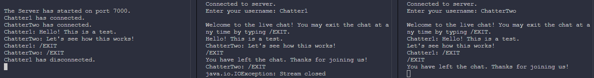

# Java Sockets Live Chat

## Table of Contents
- [Introduction](#introduction)
- [Prerequisites](#prerequisites)
- [Installation](#installation)
- [Running the Program](#running-the-program)
- [Example](#example)
- [Implementation Details](#implementation-details)
- [Contributing](#contributing)
- [License](#license)

## Introduction

This project uses Java Sockets for network communication in a live chat context. It is a simple client-server application. 
When the client sends messages to the server, the server will respond accordingly.

## Prerequisites

Before you begin, you will first need:
- The Java Development Kit (JDK) installed (You'll likely need version 8 or higher)
- An IDE (e.g., IntelliJ IDEA, Eclipse, SublimeText, Visual Studio Code)

## Installation

1. Clone the repository:
  ```sh
  git clone https://github.com/yourusername/java-sockets-live-chat.git
  ```
2. Navigate to the project directory:
  ```sh
  cd java-sockets-live-chat
  ```

## Running the Program

1. Open your commpand prompt.

2. Navigate to the `src` directory via:
  ```sh
  cd src
  ```
3. Run the ChatServer.java file first.

4. Now run the ChatClient.java file for each client that will connect and start messaging to the server.

## Example
The following is an example of the live chat program being run:



## Implementation Details
### Server

The `ChatServer.java` file contains all server-side implementation. It does the following:
- Listens for incoming client connection requests on the specified port (In this case, port 7000).
- Accepts client connections and creates a new thread for each client.
- Reads messages from each client and sends responses from other clients back.

### Client

The `ChatClient.java` file contains all client-side implementation. It does the following:
- Connects to the server using localhost and the port number (7000).
- Sends client messages to the server.
- Receives and displays responses from the server.

### Code Structure

- `ChatServer.java`: Contains a main method that starts the server and handles client connections.
- `ChatClient.java`: Contains a main method that starts and connects the client to communicate with the server.

## Contributing
If you wish to contribute, please follow these steps:

1. Fork the repository.
2. Create a new branch (`git checkout -b feature-branch`).
3. Make your changes.
4. Commit your changes (`git commit -m 'your feature'`).
5. Push to the branch (`git push origin feature-branch`).
6. Open a pull request.

## License
This project is licensed under the MIT License. See the [LICENSE](LICENSE) file for details.